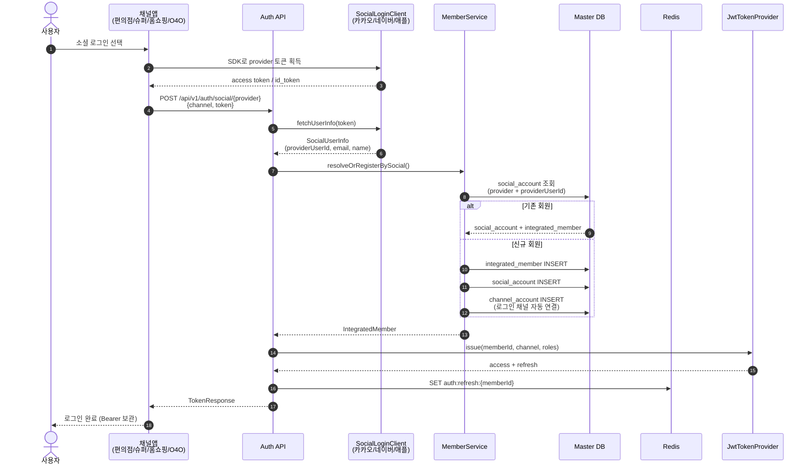
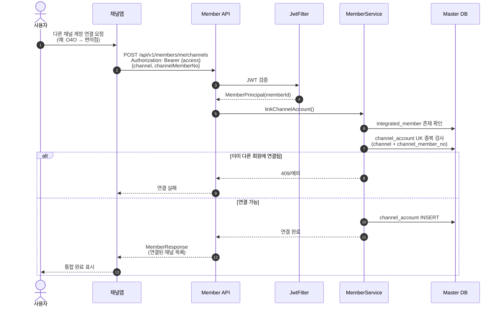
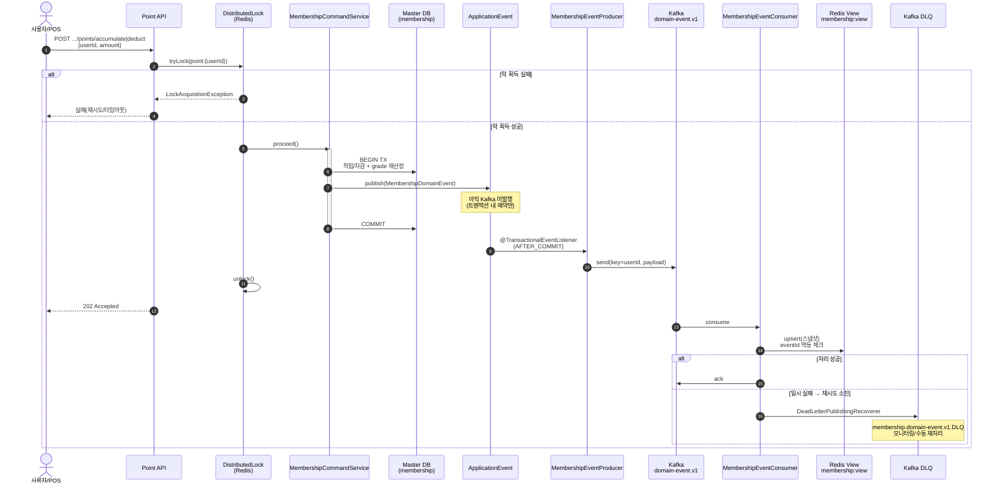
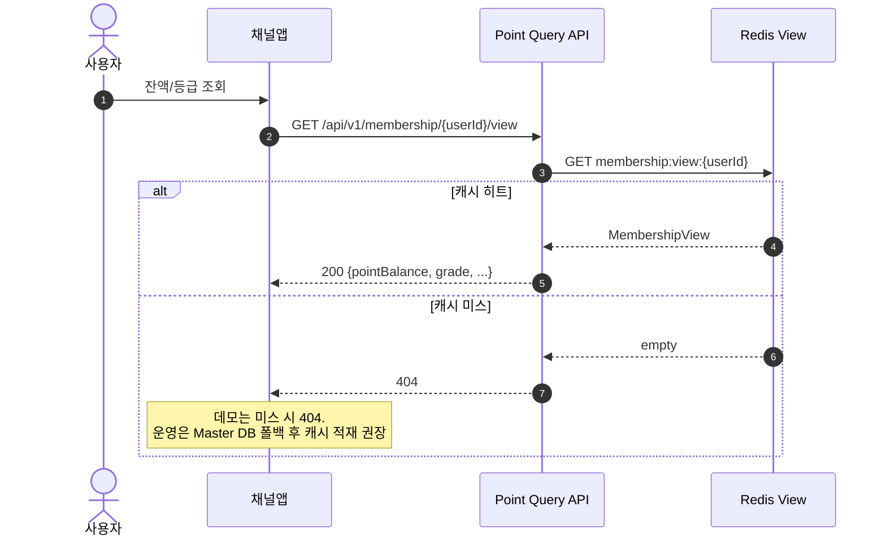
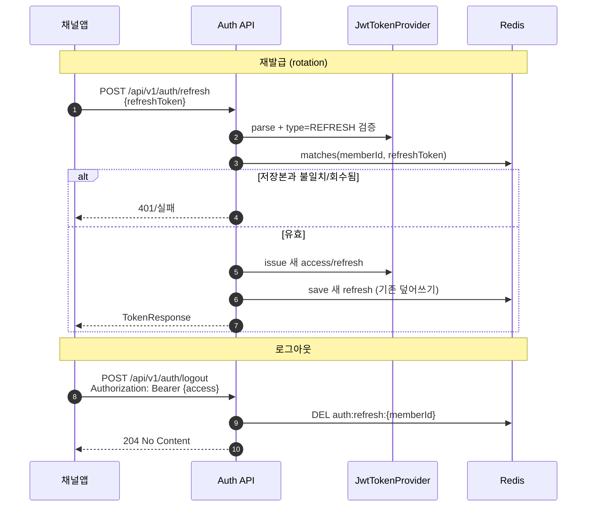

# 통합 회원·멤버십 시스템 데모

편의점 / 슈퍼 / 홈쇼핑 / O4O 4대 채널을 통합하는 회원·멤버십 플랫폼의 핵심 레이어를 구현한 데모입니다.

| 영역 | 내용 |
|---|---|
| **회원** | 통합 회원 식별, 채널 계정 연결, 소셜 아이덴티티 매핑 |
| **인증** | Spring Security + JWT, 소셜 로그인(카카오/네이버/애플) |
| **포인트** | 분산 락 기반 적립/차감, Kafka EDA로 Redis 조회 뷰 동기화 |

## 기술 스택

- Java 17, Spring Boot 3.3.x
- Spring Security, JJWT
- Spring Data JPA (데모: H2)
- Redisson (분산 락 + Cache-Aside 뷰 + Refresh 토큰 저장)
- Spring Kafka, Resilience4j

## 4대 채널

| enum | 채널 | 설명 |
|---|---|---|
| `CVS` | 편의점 | 오프라인 편의점 |
| `SUPERMARKET` | 슈퍼 | 슈퍼마켓 |
| `HOME_SHOPPING` | 홈쇼핑 | 홈쇼핑/커머스 |
| `O4O_APP` | O4O | Online for Offline 앱 |

## 패키지 구조 (바운디드 컨텍스트)

```
com.retail.membership
├── auth/                 # 로그인·JWT·소셜 provider 전략
├── member/               # 통합 회원·채널 계정·소셜 계정
├── point/                # 포인트·등급 CQRS (바운디드 컨텍스트)
│   ├── api/              # REST Controller
│   ├── application/      # Command 서비스 (적립/차감)
│   ├── domain/           # Master DB 애그리거트
│   ├── event/            # Kafka Producer/Consumer/DLQ
│   └── query/            # Redis 조회 뷰
├── common/lock/          # @DistributedLock AOP (공용)
└── config/               # 앱 전역 설정
```

## 아키텍처 요약

### 1) 통합 회원 + 인증

```
[클라이언트] 소셜 SDK 토큰
   → POST /api/v1/auth/social/{kakao|naver|apple}
   → SocialLoginClient(전략)로 사용자 식별
   → IntegratedMember 조회/신규 생성 + SocialAccount·ChannelAccount 연결
   → JWT(access/refresh) 발급, refresh는 Redis 저장

[클라이언트] Authorization: Bearer {access}
   → GET  /api/v1/members/me
   → POST /api/v1/members/me/channels   # 채널 계정 추가 연결
```

로그인 수단(소셜)과 비즈니스 채널(편의점/슈퍼/홈쇼핑/O4O)은 별개 축으로 모델링합니다.

### 2) 포인트 (CQRS + EDA)

```
[Command] POST /api/v1/membership/points/accumulate|deduct
   → @DistributedLock (유저 단위 상호 배제)
   → @Transactional Master DB 변경
   → AFTER_COMMIT → Kafka membership.domain-event.v1
   → Consumer → Redis 뷰(membership:view:{userId}) 준실시간 동기화
   → 최종 실패 시 membership.domain-event.v1.DLQ
```

## 비즈니스 프로세스 흐름도

### 1) 소셜 로그인 · JWT 발급



### 2) 채널 계정 연결 (4채널 통합)



### 3) 포인트 적립/차감 · 조회 뷰 동기화



### 4) 조회 (Cache-Aside)



### 5) 토큰 재발급 · 로그아웃



## RDB 테이블

데모는 H2 인메모리 + `ddl-auto: create-drop` 으로 기동 시 생성됩니다. 운영에서는 Master DB(MySQL/Oracle 등)로 교체합니다.

### ER 관계 (개념)

```
integrated_member (1)
   ├── social_account (N)     # 로그인 수단 (카카오/네이버/애플)
   └── channel_account (N)    # 비즈니스 채널 (편의점/슈퍼/홈쇼핑/O4O)

membership                    # 포인트·등급 (user_id 기준, Command Master)
```

> `membership.user_id` 는 데모에서 포인트 API의 `userId` 를 그대로 씁니다.  
> 운영에서는 `integrated_member.member_id` 와 동일 키로 맞추는 것을 권장합니다.

### 1) `integrated_member` — 통합 회원

| 컬럼 | 타입(개념) | PK/UK | 설명 |
|---|---|---|---|
| `member_id` | VARCHAR(36) | PK | 통합 회원 ID (UUID) |
| `ci` | VARCHAR(200) | UK | 본인확인 연계정보(동일인 식별). 운영 시 암호화 필수 |
| `name` | VARCHAR(50) | | 이름 |
| `phone` | VARCHAR(20) | | 휴대폰 |
| `email` | VARCHAR(100) | | 이메일 |
| `status` | VARCHAR(20) | | `ACTIVE` / `DORMANT` / `WITHDRAWN` |
| `created_at` | TIMESTAMP | | 생성 시각 |

엔티티: `member.domain.IntegratedMember`

### 2) `social_account` — 소셜 로그인 아이덴티티

| 컬럼 | 타입(개념) | PK/UK | 설명 |
|---|---|---|---|
| `id` | BIGINT | PK | 대리키 |
| `member_id` | VARCHAR(36) | | 통합 회원 ID (FK 개념) |
| `provider` | VARCHAR(20) | UK(복합) | `KAKAO` / `NAVER` / `APPLE` |
| `provider_user_id` | VARCHAR(100) | UK(복합) | provider 부여 사용자 ID |
| `linked_at` | TIMESTAMP | | 연결 시각 |

- UK: `(provider, provider_user_id)` → 동일 소셜 계정 중복 연결 방지  
- 엔티티: `member.domain.SocialAccount`

### 3) `channel_account` — 채널 계정 연결

| 컬럼 | 타입(개념) | PK/UK | 설명 |
|---|---|---|---|
| `id` | BIGINT | PK | 대리키 |
| `member_id` | VARCHAR(36) | | 통합 회원 ID (FK 개념) |
| `channel` | VARCHAR(20) | UK(복합) | `CVS`(편의점) / `SUPERMARKET`(슈퍼) / `HOME_SHOPPING`(홈쇼핑) / `O4O_APP`(O4O) |
| `channel_member_no` | VARCHAR(100) | UK(복합) | 채널 레거시 회원번호 |
| `status` | VARCHAR(20) | | `ACTIVE` / `UNLINKED` |
| `linked_at` | TIMESTAMP | | 연결 시각 |

- UK: `(channel, channel_member_no)` → 채널 내 회원번호 유일성  
- 엔티티: `member.domain.ChannelAccount`

### 4) `membership` — 포인트·등급 (Command Master)

| 컬럼 | 타입(개념) | PK/UK | 설명 |
|---|---|---|---|
| `user_id` | VARCHAR | PK | 포인트 주체 식별자 |
| `point_balance` | BIGINT | | 사용 가능 잔액 |
| `total_accumulated_point` | BIGINT | | 누적 적립(등급 산정용, 차감해도 감소하지 않음) |
| `grade` | VARCHAR | | `WELCOME` / `SILVER` / `GOLD` / `VIP` |
| `version` | BIGINT | | 낙관적 락 (`@Version`) |

엔티티: `point.domain.Membership`

### Redis에만 존재하는 데이터 (RDB 아님)

| 키 패턴 | 용도 |
|---|---|
| `membership:lock:point:{userId}` | 포인트 변경 분산 락 |
| `membership:view:{userId}` | 조회용 포인트/등급 Cache-Aside 뷰 |
| `auth:refresh:{memberId}` | JWT refresh 토큰 저장(재발급·로그아웃) |

## Kafka 토픽

설정: `application.yml` → `retail.membership.kafka.*`  
기동 시 `KafkaTopicConfig` 가 토픽을 자동 생성합니다(데모: partitions=3, replicas=1).

> **용어**: 본 프로젝트는 실패 메시지 보관소를 **DLQ(Dead Letter Queue)** 로 통일합니다.  
> Spring Kafka 문서의 **DLT(Dead Letter Topic)** 와 같은 개념이며, Kafka는 Queue가 아니라 Topic이라 프레임워크 쪽 용어만 DLT입니다.

| 토픽 | 용도 | Producer | Consumer | 파티션 키 | Consumer Group |
|---|---|---|---|---|---|
| `membership.domain-event.v1` | 포인트/등급 변경 도메인 이벤트 전파. Master DB 커밋 성공(`AFTER_COMMIT`) 이후에만 발행. 페이로드에 최종 스냅샷(잔액·누적·등급)을 실어 Query 측이 멱등 upsert 가능 | `MembershipEventProducer` | `MembershipEventConsumer` → Redis 뷰 동기화 | `userId` (동일 유저 이벤트 순서 보장) | `membership-view-sync` |
| `membership.domain-event.v1.DLQ` | Dead Letter Queue. 도메인 이벤트 처리가 재시도 소진 후에도 실패하면 이관. 모니터링·수동 재처리용 | Kafka `DeadLetterPublishingRecoverer` (에러 핸들러) | `MembershipDlqConsumer` (로그/알림) | 원본 파티션 유지 | `membership-dlq-monitor` |

### 도메인 이벤트 페이로드 (`membership.domain-event.v1`)

| 필드 | 설명 |
|---|---|
| `eventId` | 이벤트 고유 ID (멱등 처리용) |
| `userId` | 대상 유저 |
| `eventType` | `POINT_ACCUMULATED` / `POINT_DEDUCTED` / `GRADE_CHANGED` |
| `amount` | 변동 금액 |
| `pointBalance` | 변경 후 잔액 |
| `totalAccumulatedPoint` | 변경 후 누적 적립 |
| `grade` | 변경 후 등급 |
| `occurredAt` | 발생 시각 |

### 처리 흐름

```
Master DB 커밋 성공
  → membership.domain-event.v1 발행
  → [성공] Redis 뷰 갱신 + 수동 ack
  → [일시 실패] Resilience4j Retry + Kafka 지수 백오프 재시도
  → [최종 실패] membership.domain-event.v1.DLQ 로 이관
```

## API 요약

| Method | Path | 인증 | 설명 |
|---|---|---|---|
| POST | `/api/v1/auth/social/{provider}` | 불필요 | 소셜 로그인 (kakao/naver/apple) |
| POST | `/api/v1/auth/refresh` | 불필요 | 토큰 재발급 |
| POST | `/api/v1/auth/logout` | Bearer | refresh 회수 |
| GET | `/api/v1/members/me` | Bearer | 내 통합 회원 + 채널 목록 |
| POST | `/api/v1/members/me/channels` | Bearer | 채널 계정 연결 |
| POST | `/api/v1/membership/points/accumulate` | 불필요(데모) | 포인트 적립 |
| POST | `/api/v1/membership/points/deduct` | 불필요(데모) | 포인트 차감 |
| GET | `/api/v1/membership/{userId}/view` | 불필요(데모) | Redis 포인트 뷰 조회 |

## 실행

```bash
# 1) Redis + Kafka
docker-compose up -d

# 2) 앱 (Java 17)
export JAVA_HOME=$(/usr/libexec/java_home -v 17)
./gradlew bootRun
# 또는: gradle bootRun
```

### Postman

`postman/membership.postman_collection.json` 을 Import 한 뒤:

1. **인증 > 애플 로그인(데모)** 실행 → accessToken 자동 저장
2. **통합회원 > 내 정보 조회** / **채널 계정 연결**
3. **포인트** 적립·차감·뷰 조회

### curl 예시

```bash
# 포인트 적립/조회
BASE=http://localhost:8080/api/v1/membership
curl -X POST $BASE/points/accumulate -H 'Content-Type: application/json' \
  -d '{"userId":"u1","amount":50000}'
curl $BASE/u1/view
```

## 핵심 설계 포인트

1. **락 → 트랜잭션 → 커밋 → 락 해제**  
   `DistributedLockAspect`를 `@Order(Integer.MIN_VALUE)`로 두어 트랜잭션보다 바깥에서 실행.

2. **커밋 이후에만 Kafka 발행**  
   `@TransactionalEventListener(AFTER_COMMIT)`로 유령 이벤트 방지.

3. **소셜 로그인 확장**  
   `SocialLoginClient` 전략 + Registry. provider 빈 추가만으로 확장.

4. **Stateless JWT**  
   access/refresh 분리, refresh는 Redis에 저장해 재발급·로그아웃(회수) 지원.

5. **결함 허용**  
   Resilience4j Retry + Kafka DefaultErrorHandler → DLQ.

## 운영 시 고려사항 (데모 범위 밖)

- 커밋 후 발행의 유실 가능성 → Transactional Outbox + CDC 권장
- Apple id_token은 JWKS 서명 검증 필수 (데모는 클레임 파싱만)
- Redis 락: Sentinel/Cluster
- CI/PII 암호화, 뷰 리컨실리에이션 배치
